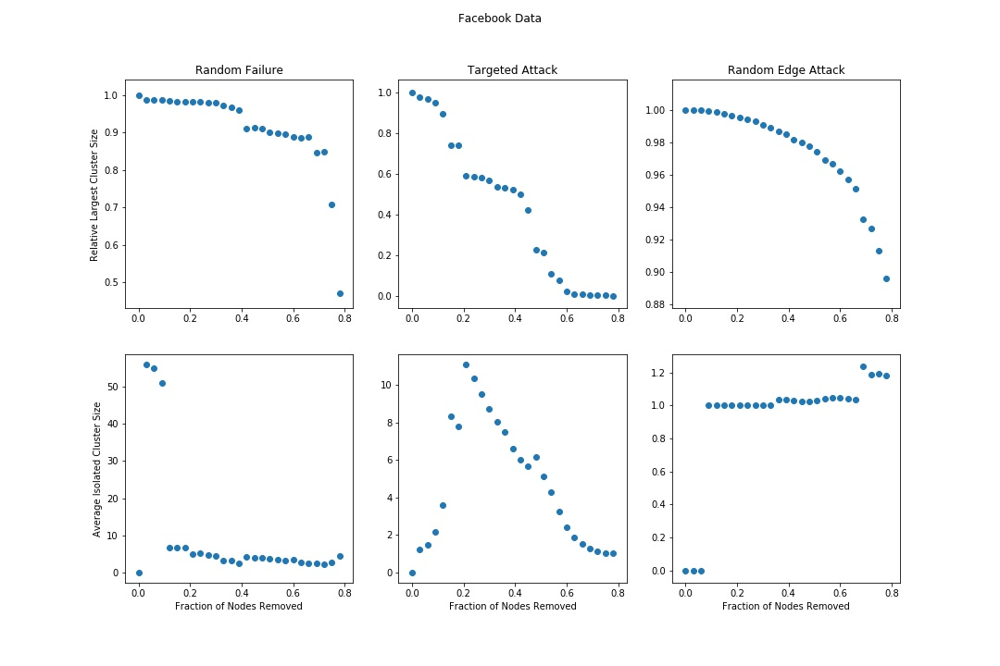

# Robustness of Complex Graphs with Random Failures and Targeted Attacks
### Will Fairman and David Tarazi

## Abstract
Albert, Jeong, and Barabasi explore the robustness of different complex graphs by looking at two specific types of failure: removing random nodes vs removing nodes with the highest degree. With small rates of failure, the authors use the average shortest path length as a characteristic of robustness. With high rates of failure, where a graph is likely to become disconnected, the authors instead associate robustness with the percentage of nodes that are in the largest connected cluster: representing how much of a network is still usable. This paper specifically compared the Erdos and Renyi (ER) random graph model and the Watts and Strogatz (WS) small world model. We have generated both types of graphs using networkX and are planning on using the python library for this experiment as well. As an extension to the author's paper, we will explored the robustness of these networks to a new kind of attack: random edge removal. We will also apply the tools we create to anaylze robustness on real world networks (power grids, road networks) to determine what type of failure modes these graphs are susceptible to.

## Experiment
In our exploration, we will replicate some of the experiments that Albert, Jeong, and Barabasi conducted while extending this application to a real world example. In our replication, we will implement two graphs: a WS Scale Free Network, and an ER Exponential Network following their size and number of edges. We then will conduct a random attack on the nodes as well as a targeted attack on the most connected nodes. When analyzing these, we will look at the average shortest path length for both graphs as we remove nodes. We will also evaluate the size of the largest cluster along with the average size of the isolated clusters as the graph disconnects over enough failures/attacks. We hope that we can find the critical failure value where these networks become disconnected.

After implementing these tools, we will expand our types of attacks to include random edge removal. This could be an interesting analysis as it draws similiraties to failures in real-world graphs. For example, if a power line is severed during a storm, power may be cut off between a house and a power substation. In this case, removing a node (house, substation) would not properly reflect this type of failure. 

Once we have expanded our analysis tools, we will look at a model we downloaded for an electrical grid in order to analyze the electrical grid’s robustness to both random failure (as if during a bad storm) and attacks on that grid.

## Results

### Average Shorest Path Length
The following figure shows the results from Albert, Jeong, and Barabasi's experiment on exponential graphs (ER) and scale-free graphs (WS). The x-axis reflects the percentage of the nodes removed durring the attack while the y-axis shows the diameter, average shortest path length, of the graphs. For both types of graphs, the authors used a node size of 10,000 and an edge count of 20,000.

**Figure 1:** Paper's Diagram showing path length as nodes are removed randomly and targeted.

The next figure shows our implementation of the authors' work. While our shortest path lengths are offset by about 10, the general characteristics of the graphs hold. The exponential (ER) graph shows little difference when under a random or targeted attack. However, the scale-free graph's (WS) path lengths increase at a much faster rate when large nodes are removed.

**Figure 2:** Path length replication as nodes are removed randomly and targete

To see a comparison to real-world data, we also plotted the facebook dataset used previously in class. This dataset is an example of a small-world graph with 4,039 nodes and 88,234 edges. As you can see below, the starting shortest path length is much smaller than our previous examples. This is attributed to the much larger edge to node ratio in the facebook data. The facebook graph, however, still reflects the characteristics of our original scale-free graph. A random attack has almost no affect on the path length while the targeted attack nearly doubles the average path length in the first round followed by an overall steeper slope. 

**Figure 3:** Path Length characteristic of a facebook friends dataset with 4,039 nodes and 88,324 edges.

### Cluster Size
The next characteristic the authors observed was the average isolated cluster size and relative cluster size. An isolated cluster is defined as any cluster that is not part of the largest cluster and the average isolated cluster size is the average number of nodes in all of the isolated clusters. The relative cluster size is the size of the largest cluster normalized by the total number of nodes left in the network. The following diagram shows the author's results when plotting these characteristics from their ER and WS graphs.

**Figure 4:** Paper's average clustering as nodes are removed randomly and targeted. The figure also shows real-world data sets used by the authors to reflect small-world and exponential graphs.

Our results begin to diverge with the authors' when calculating the isolated cluster size and largest relative cluster. When looking at the relative largest cluster size, both the expontential and scale-free graphs stay close to 1 until hitting a critical percentage of nodes removed and drop rapidly towards 0. For the exponential graph this is expected behavior in both the random and targeted attacks: with a critical percentage closer to 0 during a targeted attack. This relation also holds true for the scale-free network under a targeted attack. However, the authors suggest that the largest cluster size of the scale free graph should decrease linearly under a random attack. This does not align with our graph which shows a fairly steep decline in the graph's cluster size around 30% of the nodes removed.

The average isolated cluster size differs even more when comparing to the paper's original graph. For an exponential graph, the paper shows a spike in isolated cluster sizes around the critical point in which the largest cluster size falls rapidly. Under a random attack, we do not see a spike in isolated cluster sizes. However, we also don't see a critical point within the range plotted: this could suggest that this spike does occur but not in this sample of data collected. There is a spike in isolated cluster sizes when an exponential graph experiences targeted attacks: also lining up with the critical point where cluser size drops. This relationship also holds true for the scale-free graph under a targeted attack. According the paper, the scale-free graph should not see a spike in isoalted clusters during a random attack because there is no crictical point at which the largest cluster size falls. However, because we see this critical point in our own data, we also see a spike in isolated clusters. 

**Figure 4:** Average isolated cluster size and relative cluster size plotted for our ER and WS graphs with nodes=10,000 and edges=20,000.

Again, we used the facebook dataset to compare our results with a real-world small world graph. The characteristics of the facebook data closer resemble the results we produced rather than the expected results from paper.

### Random Edge Removal
We were able to implement a random edge removal attack. The following figure shows how our exponential and random graphs respond to this type of attack. We also plotted the response of these graphs to all of the attacks mentioned previously. The randome edge removal behaves fairly similar to the random node attack.

 

Again, we plotted a random edge attack on the facebook dataset to see how a real-world graph is effected by the this type of attack. 

## Causes of Concern

## Annotated Bibliography
[Error and Attack Tolerance of Complex Networks](https://www.nature.com/articles/35019019.pdf?origin=ppub)  
Albert, R., Jeong, H. & Barabási, AL. Error and attack tolerance of complex networks. Nature 406, 378–382 (2000). https://doi.org/10.1038/35019019
>This paper discusses some of the implications of random and targeted attacks on ER and WS graphs (as well as an Internet model) in order to quantify their robustness to these attacks.

[Western US States Power Grid Network Model](http://konect.cc/networks/opsahl-powergrid/)
>This model represents the Western US States’ power grid that we plan to use for our experimentation. The nodes are transformers, substations, and generators, and the edges are high-voltage transmission lines.
