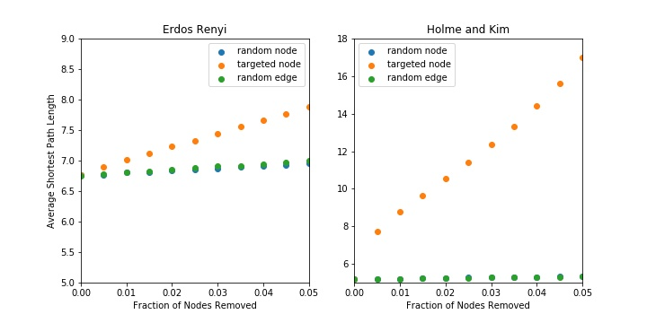
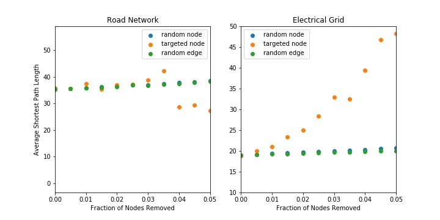

# Robustness of Complex Graphs with Random Failures and Targeted Attacks
### Will Fairman and David Tarazi

## Abstract
Albert, Jeong, and Barabasi explore the robustness of different complex graphs by looking at two specific types of failure: removing random nodes and systematically removing nodes with the highest degree. With small rates of failure, the authors use the average shortest path length as a characteristic of robustness. With high rates of failure, where a graph is likely to become disconnected, the authors instead associate robustness with the percentage of nodes that are in the largest connected cluster, representing the percentage of nodes that are still reachable and the average size of the isolated clusters. To expand upon the paper, we implemented random edge removal as another way to attack these complex graphs and evaluate their robustness.  While the authors specifically compared the Erdos and Renyi (ER) random graph model and a scale-free model, we expanded the robustness analysis by looking at two real-world data sets: the Facebook social network (a known small-world graph), a graph representing the power grid of the Western United States, and a graph representing the Minnesota road network.

## Introduction
By comparing different graph models and their properties in response to random attacks or failures, we can investigate which types of models would be best for specific applications. For example, in the design of an electrical grid, maintaining a connected graph is more important than the shortest path length between any two nodes. Alternatively, in the design of a road network, the shortest path between any two nodes representing cities or locations in a city is probably an important consideration, especially if the edges are weighted and there can be an analysis of how long it would take to traverse from one node to another.

<!-- The results suggest that random graphs like the ER model are more robust than small world graphs like the WS model in most, but not all aspects. We noticed that with small fractions of failures or targets, the random graph is just as robust to targeted node attacks and random node and edge attacks. However, the random graphs tend to lose the connected property earlier than the small world graphs. At scale, we noticed that the relative size of the largest cluster for random graphs stays much higher than the small world graphs with random deletion of nodes and edges, but with targeted attacks, we observe that the random and small world graphs both tend to have a critical failure point where the largest cluster size decreases rapidly at around 20-30% of total node removal. Furthermore, when applying the attacks to the Facebook model, we observe that the nodes with a high degree fail early and the robustness of the graph is less than both other models we analyzed. -->

## Experiment
In our exploration, we replicate some of the experiments that Albert, Jeong, and Barabasi conducted while extending this application to a couple real-world examples. In our replication, we will implement two graphs: a scale free (SF) and a Erdos and Renyi (ER) random model which the authors refer to as an exponential graph (E). Since the authors don't mention what model they used for the scale free graph, we decided to use the Holmes-Kim (HK) model due to its power law properties when looking at degree distribution. Furthemore, when comparing the average path length for the HK graph against the starting average path length for the authors' scale-free graph, the values are very similar. For both of these models, we use a node and edge count the authors use in the paper: 10,000 nodes and 20,000 edges. For the HK graph, we used a triangular connection probability of 0.5 which was chosen arbitrarily since it was not mentioned in the original paper. We implement the removal by defining a step size correlating to the fraction of the starting total nodes to remove during each step. When analyzing these, we will look at the average shortest path length for both graphs as we remove nodes. We will also evaluate the size of the largest cluster along with the average size of the isolated clusters as the graph disconnects over enough failures/attacks. 

After implementing these tools, we then expand our types of attacks to include random edge removal. We hope that by implementing edge removal, we can understand more about graph robustness. In the power grid example, if a power line is severed during a storm, power may be cut off between a town and a power substation. In this case, removing a node (representing a substation) would not properly reflect this type of failure, but an edge removal could. In this experiment, we use a step size representing the fraction of the original edges to remove during each step, then calculating the graph properties after each step. Once we have expanded our analysis tools, we will look at a model we downloaded for an electrical grid in order to analyze the electrical grid’s robustness to both random failure (as if during a bad storm) and attacks on that grid. Another extension we implemented was conducting the same experiments to analyze robustness on a graph model of the Minnesota road network. 

## Results

### Average Shortest Path Length
The following figure shows the results from Albert, Jeong, and Barabasi's experiment on exponential graphs (ER) and scale-free graphs (HK). The x-axis reflects the percentage of the nodes removed during the attack while the y-axis shows the diameter, or average shortest path length between two randomly selected nodes, of the graphs. For both types of graphs, the authors used graphs with 10,000 nodes and 20,000 edges. In Figure 1, the authors of the original paper plotted the average path length between any two nodes as the ratio of removed nodes to starting nodes increased. 

**Figure 1:** Graph from Albert, R., Jeong, H. & Barabási, AL that shows average path length of exponential (E) and scale-free (SF) networks. The x-axis is the fraction of nodes removed. The y-axis is the average shortest path length. Two types of attacks are applied. The first is a random node removal labeled as "Failure" and the second is a targeted node removal labeled "Attack" where the node with the largest degree is systematically removed.

The next figure shows our implementation of the authors' work with the addition of random edge removal. 

**Figure 2:** Replication of average path length graph shown in Figure 1. Nodes are removed randomly and targeted with a HK and an ER graph both with 10,000 nodes and 20,000 edges. The HK probability of a triangle is 0.5. In our replication, we also included a random edge attack.

**Figure 3:** Replication of average path length graph shown in Figure 1 using road network and electrical grid data.

The general characteristics of the graphs hold. The exponential (ER) graph shows little difference in average path length when under a random or targeted attack, although our results suggest that the random attack on a fully random graph is slightly more robust than a targeted attack on the same graph while the authors' results suggest they are equally robust. However, this difference is miniscule and the general trend for the ER random graph demonstrates that the average path length should change minimally with a small percentage of the nodes removed. Furthermore, the difference between random edge removal and random node removal is negligable; the random edge removal seems to hold the same results as the random node removal in the ER graph. 

On the other hand, the HK model we used to model the scale free graph seems to reflect the same results as the authors'. For random removals of edges and nodes, we see almost no change in the shortest path length form 0-5% of the nodes/edges removed. However, the HK graph suffers greatly when a targeted attack is executed as the average shortest path length increases from roughly 5 nodes away to roughly _________ nodes away after just 5% of the highest degree nodes are removed. These results make sense. The degree distribution in a random graph is close to uniform, so we would expect no difference in the random or targeted attack, but the degree distribution in the HK model is long-tailed, meaning most nodes have a small degree, but there are a few nodes that have a very large degree and those will be targeted first in a targeted attack.

To see a comparison to real-world data, we also analyzed the average shortest path length of the Power Grid dataset and the Minnesota road dataset.
<!-- To better reflect this difference, we plotted WS and ER graphs in Figure 3 that have the same number of nodes and edges as the Facebook and Electrical Grid data respectively. -->

In the Facebook model, a random attack with small percetages of the nodes being removed has almost no affect on the path length while the targeted attack nearly doubles the average path length in the first round followed by an overall steeper slope. The removal of the few "most popular" people in this graph model doubles the number of people you are away from any other person, so keep your popular friends safe! 

### Cluster Size
The next characteristic the authors observed was the average isolated cluster size and relative largest cluster size. An isolated cluster is defined as any cluster that is not part of the largest cluster and the average isolated cluster size is the average number of nodes in all of the isolated clusters. The relative largest cluster size is the size of the largest cluster normalized by the total number of nodes left in the network. The following diagram shows the author's results when plotting these characteristics from their ER and WS graphs.

**Figure 4:** Paper's average clustering as nodes are removed randomly and targeted. The figure also shows real-world data sets used by the authors to reflect small-world and exponential graphs.

Figure 4 is a little difficult to interpret. Essentially, the results from Albert, Jeong, and Barabasi suggest that at scale, small world models tend to have a higher relative largest cluster size even as many nodes are removed on a linear relationship with random removals when compared to random graphs, but small world graphs fail quicker when there is a targeted attack (as shown in the top row of the figure). Our results begin to diverge with the authors' when calculating the isolated cluster size and largest relative cluster. When looking at the relative largest cluster size, both the expontential and scale-free graphs stay close to 1 until hitting a critical percentage of nodes removed and drop rapidly towards 0. For the exponential graph this is expected behavior in both the random and targeted attacks as eventually the central node is spread thin and splits into many smaller clusters. This relation also holds true for the scale-free network under a targeted attack. However, the authors suggest that the largest cluster size of the scale free graph should decrease linearly under a random attack. This does not align with our graph which shows a fairly steep decline in the graph's cluster size around 20-30% of the nodes removed. Our results imply that random graphs hold their largest cluster much more effectively than small world graphs under a random attack, but under a targeted attack, the two models are similar in how they hold their largest cluster size.

The average isolated cluster size differs even more when comparing to the paper's original graph. For an exponential graph, the paper shows a spike in isolated cluster sizes around the critical point in which the largest cluster size falls rapidly. Under a random attack, we do not see a spike in isolated cluster sizes. However, we also don't see a critical point within the range plotted. This could suggest that this spike does occur, but not in this sample of data collected. There is a spike in isolated cluster sizes when an exponential graph experiences targeted attacks: also lining up with the critical point where cluser size drops. This relationship also holds true for the scale-free graph under a targeted attack. According the paper, the scale-free graph should not see a spike in isoalted clusters during a random attack because there is no crictical point at which the largest cluster size falls. Because we see this critical point in our own data, we also see a spike in isolated clusters. One major difference between the exponential and small world models is that the exponential models often have clusters that end up having just a single isolated node or many of them as the removal continues. On the other hand, the average isolated cluster size appears to grow until a certain point (or spike) in the small world model. This growth implies that the small world model ends up splitting into many clusters of a much larger size than the random graph so those clusters could stay connected where the random graph may isolate individual nodes much more often. In a cellular communication network for instance, it may be advantageous to have these smaller clusters appear as most people don't need to call outside of their immediate area as failures occur. While the random graph appears much more robust, there are advantages to both models depending on what the network is attempting to optimize.

**Figure 5:** Relative cluster size plotted for our ER and SF graphs with nodes=10,000 and edges=20,000 with probability of triangle = 0.5 in the SF graph.

Again, we used the Facebook dataset to compare our results with a real-world small world graph. The characteristics of the Facebook data closer resemble the results we produced rather than the expected results from paper.

**Figure 6:** Relative cluster size plotted for the road network and electrical grid graphs.

### Isolated Cluster Size

 

**Figure 7:** Average isolated cluster size plotted for our ER and SF graphs with nodes=10,000 and edges=20,000 with probability of triangle = 0.5 in the SF graph.

 

**Figure 8:** Average isolated cluster size plotted for the road network and electrical grid graphs.

Beyond just random node removal, we implemented a random edge removal. The following figure shows our exponential and random graphs' response to this type of attack. We also plotted the response of these graphs to all of the attacks mentioned previously. The randome edge removal behaves fairly similar to the random node attack. Following the pattern of random node removal, the random graph appears to be the most robust to any type of attack on the system. 

Again, we plotted a random edge attack on the Facebook dataset to see how a real-world graph is effected by the this type of attack. As anticipated, we observed that the Facebook dataset acts very similarly to the Watts-Strogatz graph. The issue of the Facebook model's larger degree distribution doesn't show in this attack though since the removal is random and not targeted.
 

## Causes of Concern
One cause of concern that we had is that our results didn't match the results of Albert, Jeong, and Barabasi as closely as we anticipated. We worry that the way we implemented their experiment doesn't match the actual experiment that they conducted. Although we are concerned with this discrepency, we are fairly certain that our implementation accurately analyzes robustness in graphs. 

Another cause of concern or rather a question that we pose for further exploration would be how do you implement a targeted edge removal? We considered targeting edges from the most connected node or targeting edges from the least connected node to explicitly cause the graph to lose its connected property, but we couldn't determine a real application where this data would provide greater insight into determining which graph to use solely on its robustness.

Finally, we are concerned that we haven't explored how to choose which model is best to follow when trying to design a system and we wonder if we have provided enough information given just these few models to determine which graph to choose. In the future, we would like to explore more real-world models and how they respond to these attacks. It's possible that there are better options that still achieve the functionality that users are looking for when designing networks. For others exploring this field, we would challenge you to explore different models and think about how to model graphs through a lens of robustness.

## Our Next Steps
Will and I plan on testing different networks such as an electrical grid and we hope to look into potentially exploring another type of model if we end up having the time to do so. We feel confident in our results thus far, but we will also be checking our experiments to see if we can find where the discrepency between our results and the paper we followed's experiments lies.

## Annotated Bibliography
[Error and Attack Tolerance of Complex Networks](https://www.nature.com/articles/35019019.pdf?origin=ppub)  
Albert, R., Jeong, H. & Barabási, AL. Error and attack tolerance of complex networks. Nature 406, 378–382 (2000). https://doi.org/10.1038/35019019
>This paper discusses some of the implications of random and targeted attacks on ER and WS graphs (as well as an Internet model) in order to quantify their robustness to these attacks.

[Western US States Power Grid Network Model](http://konect.cc/networks/opsahl-powergrid/)
>This model represents the Western US States’ power grid that we plan to use for our experimentation. The nodes are transformers, substations, and generators, and the edges are high-voltage transmission lines.
