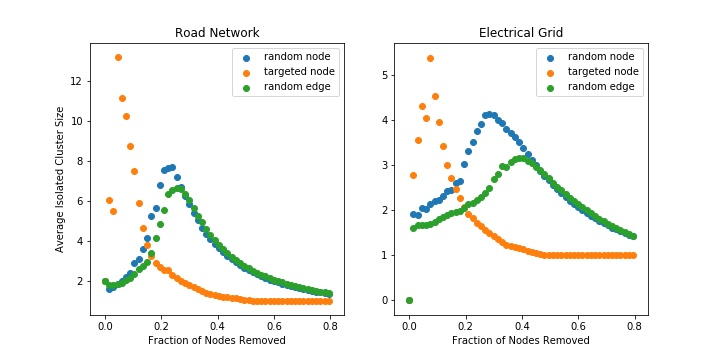

# Robustness of Complex Graphs with Random Failures and Targeted Attacks
### Will Fairman and David Tarazi

## Abstract
Albert, Jeong, and Barabasi explore the robustness of different complex graphs by looking at two specific types of failure: removing random nodes and systematically removing nodes with the highest degree. With small rates of failure, the authors use the average shortest path length as a characteristic of robustness. With high rates of failure, where a graph is likely to become disconnected, the authors instead associate robustness with the percentage of nodes that are in the largest connected cluster, representing the percentage of nodes that are still reachable and the average size of the isolated clusters. To expand upon the paper, we implemented random edge removal as another way to attack these complex graphs and evaluate their robustness.  While the authors specifically compared the Erdos and Renyi (ER) random graph model and a scale-free model, we expanded the robustness analysis by looking at two real-world data sets: a graph representing the power grid of the Western United States, and a graph representing the Minnesota road network.


## Introduction
By comparing different graph models and their properties in response to random attacks or failures, we can investigate which types of models would be best for specific applications. For example, in the design of an electrical grid, maintaining a connected graph is more important than the shortest path length between any two nodes. Alternatively, in the design of a road network, the shortest path between any two nodes representing cities or locations in a city is probably an important consideration, especially if the edges are weighted and there can be an analysis of how long it would take to traverse from one node to another. Furthermore, investigating models of systems that already exist can provide insight on where the system is weak and give us ideas for how to make these physical systems more resilient to failure. In this paper we dive into the question: how can we quantify robustness and test physical systems for their response to attacks?


## Experiment
In our exploration, we replicate some of the experiments that Albert, Jeong, and Barabasi conducted while extending this application to a couple real-world examples. In our replication, we implemented two graphs: a scale free (SF) and an Erdos and Renyi (ER) random model which the authors refer to as an exponential graph (E). Since the authors don't mention what model they used for the scale free graph, we decided to use the Holmes and Kim (HK) model due to its power law properties when looking at degree distribution. Furthermore, when comparing the average path length for the HK graph against the starting average path length for the authors' scale-free graph, the values are similar. For both of these models, we use a node and edge count the authors use in the paper: 10,000 nodes and 20,000 edges. For the HK graph, we used a triangular connection probability of 0.5 which was chosen arbitrarily since it was not mentioned in the original paper. We implement the removal by defining a step size correlating to the fraction of the starting total nodes to remove during each step. When analyzing these, we looked at the average shortest path length for both graphs as we removed nodes. We also evaluated the size of the largest cluster along with the average size of the isolated clusters as the graph disconnects over enough failures/attacks. 

After implementing these tools, we then expand our types of attacks to include random edge removal. We hope that by implementing edge removal, we can understand more about graph robustness. In the power grid example, if a power line is severed during a storm, power may be cut off between a town and a power substation. In this case, removing a node (representing a substation) would not properly reflect this type of failure, but an edge removal could. In this experiment, we use a step size representing the fraction of the original edges to remove during each step, then calculating the graph properties after each step. Once we have expanded our analysis tools, we looked at a model we downloaded for an electrical grid in order to analyze the electrical grid’s robustness to both random failure (as if during a bad storm) and attacks on that grid. Another extension we implemented was conducting the same experiments to analyze robustness on a graph model of the Minnesota road network. In this case node and edge removal can be associated with the closure of intersections and roads due to construction, accidents, etc. 

For each experiment we averaged our results over 50 simulations. The only exceptions to this are the targeted attacks that were conducted on the road network and electrical grid. In the case of these experiments, there is no randomness as the networks remain the same and the order in which nodes are removed is constant as well.


## Results

### Average Shortest Path Length
The following figure shows the results from Albert, Jeong, and Barabasi's experiment on exponential graphs (ER) and scale-free graphs (HK). The x-axis reflects the percentage of the nodes removed during the attack while the y-axis shows the diameter, or average shortest path length between two randomly selected nodes, of the graphs. For both types of graphs, the authors used graphs with 10,000 nodes and 20,000 edges. In Figure 1, the authors of the original paper plotted the average path length between any two nodes as the ratio of removed nodes to starting nodes increased. 


**Figure 1:** Graph from Albert, R., Jeong, H. & Barabási, AL that shows average path length of exponential (E) and scale-free (SF) networks. The x-axis is the fraction of nodes removed. The y-axis is the average shortest path length. Two types of attacks are applied. The first is a random node removal labeled as "Failure" and the second is a targeted node removal labeled "Attack" where the node with the largest degree is systematically removed.

The next figure shows our implementation of the authors' work with the addition of random edge removal. Instead of calculating the shortest distance between each combination of nodes, we average a random sample of 1,000 nodes.


**Figure 2:** Replication of average path length graph shown in Figure 1. Three attacks are shown: random node/edge and targeted node removal. The ER and HK graphs contain 10,000 nodes and 20,000 edges. The HK probability of triangulation is 0.5. 

The general characteristics of the graphs hold when compared to the authors' results. The exponential (ER) graph shows little difference in average path length when under a random or targeted attack, although our results suggest that the random attack on a fully random graph is slightly more robust than a targeted attack on the same graph while the authors' results suggest they are equally robust. However, this difference is miniscule and the general trend for the ER random graph demonstrates that the average path length should change minimally with a small percentage of the nodes removed. Furthermore, the difference between random edge removal and random node removal is negligible; the random edge removal seems to hold the same results as the random node removal in the ER graph. 

On the other hand, the HK model we used to model the scale free graph seems to reflect the same results as the authors'. For random removals of edges and nodes, we see almost no change in the shortest path length from 0-5% of the nodes/edges removed. However, the HK graph suffers greatly when a targeted attack is executed as the average shortest path length increases from roughly 5 nodes away to roughly 17 nodes away after just 5% of the highest degree nodes are removed, which is a larger increase than expected. These results make sense. The degree distribution in a random graph is close to uniform, so we would expect no difference in the random or targeted attack, but the degree distribution in the HK model is long-tailed, meaning most nodes have a small degree, but there are a few nodes that have a large degree and those will be targeted first in a targeted attack.

To see a comparison to real-world data, we also analyzed the average shortest path length of the Power Grid dataset and the Minnesota road dataset.


**Figure 3:** Path Length characteristics of the Power Grid and Minnesota Road dataset. The Power Grid has 4,941 nodes and 6,594 edges. The Road graph has 2,642 nodes and 3,303 edges.

When looking at the road model and the power grid model, both graphs start with a much higher shortest path than the ER and HK models. This could be attributed partially to their structure, but also partially to the ratio of edges to nodes being smaller in these graphs. The road network is robust to random edge and node removal as the average shortest path length hardly moves over the first 5% of nodes/edges being removed. However, the results of a targeted removal seem to jump up and down as nodes are removed which could be due to some random nodes being close and others being far in the road network, though the trend for a targeted attack shows that the path length isn't affected much for the road network. Roads being closed due to accidents is likely closer to a random attack than a targeted attack though the probability of closures are likely not random, so it makes sense that the road network is nearly unaffected by random removals of edges or nodes in the graph. 

Alternatively, the power grid's shortest path lengths don't change much after random attacks on nodes or edges, though the targeted attack causes the path length to increase from 20 to close to 50 over 5% of the nodes being removed. The properties of the power grid seem to reflect what we saw from the scale free networks before, so there may be an optimization in robustness either for random attacks or in other properties since path length may not be as important for a power grid.


### Cluster Size
The next characteristic the authors observed was the average isolated cluster size and relative largest cluster size. An isolated cluster is defined as any cluster that is not part of the largest cluster and the average isolated cluster size is the average number of nodes in all of the isolated clusters. The relative largest cluster size is the size of the largest cluster normalized by the total number of nodes left in the network. The following diagram shows the author's results when plotting these characteristics from their exponential and scale free graphs. 


**Figure 4:** Graph from Albert, R., Jeong, H. & Barabási, AL that shows average clustering as nodes are removed randomly and targeted.

Figure 4 is difficult to interpret. Essentially, the results from Albert, Jeong, and Barabasi suggest that scale free models tend to have a higher relative largest cluster size as many nodes are removed randomly with a linear relationship to percentage of nodes removed. The tradeoff here is that scale free graphs fail quickly when there is a targeted attack. On the other hand, the behavior for random graphs is roughly the same for both targeted and random attacks. When looking at the relative largest cluster size in a targeted attack, both the exponential and scale-free graphs stay close to 1 until hitting a critical percentage of nodes removed and drop rapidly towards 0. In the scale free graph, this critical percentage is lower than in the random graph meaning under a targeted attack, the largest size of a connected cluster will taper off quicker than in a random graph. For the exponential graph this is expected behavior in both the random and targeted attacks as eventually the central node is spread thin and splits into many smaller clusters.  

When looking at the average isolated cluster sizes, the exponential graph shows a spike in isolated cluster sizes around the critical point in which the largest cluster size falls rapidly. This observation makes sense as the graph is being broken up into many small isolated clusters which eventually breaks down into a few completely isolated nodes. When looking at the scale free graph, the isolated clusters stay small, implying that as the system is under further random attack, the nodes that are separated are small clusters or completely isolated clusters.


**Figure 5:** Relative largest cluster size for our ER and HK graphs with targeted node attacks, random node removal, and random edge removal.


**Figure 6:** Average isolated cluster size for our ER and HK graphs with targeted node attacks, random node removal, and random edge removal.

Looking at Figures 5 and 6, we generated plots of relative largest cluster size and average isolated cluster size for our ER graph and our scale free HK graph with the addition of random edge removal. In this analysis, we see some characteristics of the graphs that are consistent with the authors' findings, but we also see some inconsistencies. When looking at the relative largest cluster size, the ER graph under a targeted attack reflected the authors' results where there was a critical percentage of nodes removed around 20-25% where the relative largest cluster size dropped quickly. However, the ER graph under a targeted attack in our results didn't match the authors' results. We expected to see similar trends for a targeted attack and a random attack on nodes or edges since the graph is theoretically random, but we actually see that under a random attack, the critical point where largest cluster size begins to decline is much greater than in the targeted removal at around 60% and the decline is much slower than in the targeted attack. 

In the HK graph, the results seem to align with the authors' results nearly perfectly. We see the same trends with isolated cluster size and relative largest cluster size other than the relative largest cluster size seems to eventually decay much quicker than linearly after around 70% of the nodes being removed. Another key note we have from this implementation is that the random edge removal provides slightly different results than the random node removal here. The isolated cluster size is slightly higher when removing nodes and the relative largest cluster size decays slightly faster when removing nodes as opposed to edges. This result could imply that there are a few nodes holding clusters together and when randomly plucking nodes, it is more likely to pick a critical node that is holding the cluster together than randomly selecting an edge that is holding the cluster together.

```
This might need more analysis
```
Once we compared these results, we went on to investigate the power grid and road network graphs in more depth.


**Figure 7:** Relative largest cluster size for the power grid and road network graphs with targeted node attacks, random node removal, and random edge removal.



**Figure 8:** Average isolated cluster size for the power grid and road network graphs with targeted node attacks, random node removal, and random edge removal.

When investigating the road network, it makes sense that under targeted attacks on nodes (which would target larger cities), the average isolated cluster size peaks and the largest relative cluster dips almost immediately. It would be unrealistic for all the roads going into and out of a city to shut down, so the road system likely was designed to be more resilient to random roads shutting down. We can see some of that design as almost all nodes are reachable up until about 20% of the nodes or edges are removed randomly and 1 in 5 roads/towns shutting down is improbable without a disaster occurring. Another note would be the flattening of the relative largest cluster size at around 10-20% of the nodes being removed. This behavior is likely because once you've removed the largest cities, there are many towns that are close in size and have little impact on the ability to reach any other town.

When looking at the power grid, targeted attacks also cause a rapid decline in relative largest cluster size. This behavior also makes sense as power grids likely weren't designed with the intention to be robust to targeted attacks similar to the road network. However, we were surprised that the grid is no longer fully connected if even 1% of the nodes or edges are randomly removed. It doesn't take much removal for there to be a disconnect and some isolated nodes within the network which would cause many people to lose power. One other observation we saw in our results was that random edge attacks are slightly more robust than random node attacks as the relative largest cluster size takes longer to decline in the edge removal. At 20% of the nodes randomly removed, we notice that the relative largest cluster size is around 80% but with edges, the relative largest cluster size is a bit higher at around 83-85%. This design makes sense as it is probably more likely that random power lines would fall during a storm than full transformers and generators would fail. 


## Causes of Concern
One cause of concern that we had is that our results didn't match the results of Albert, Jeong, and Barabasi as closely as we anticipated. We worry that the way we implemented the ER graph using NetworkX doesn't exactly represent a random graph since in theory there is a mostly uniform distribution of degree in a fully random graph. Although we are concerned with this discrepancy, we are fairly certain that our implementation accurately analyzes robustness in graphs. 

Another cause of concern or rather a question that we pose for further exploration would be how do you implement a targeted edge removal? We considered targeting edges from the most connected node or targeting edges from the least connected node to explicitly cause the graph to lose its connected property, but we couldn't determine a real application where this data would provide greater insight into determining which graph to use solely on its robustness. Finally, we wish we could have explored random cluster removal as sometimes failures can occur in regions as opposed to simply on one node.


## Annotated Bibliography
[Error and Attack Tolerance of Complex Networks](https://www.nature.com/articles/35019019.pdf?origin=ppub)  
Albert, R., Jeong, H. & Barabási, AL. Error and attack tolerance of complex networks. Nature 406, 378–382 (2000). https://doi.org/10.1038/35019019
>This paper discusses some of the implications of random and targeted attacks on exponential and scale free graphs (as well as an Internet model) in order to quantify their robustness to these attacks.

[Western US States Power Grid Network Model](http://konect.cc/networks/opsahl-powergrid/)
>This model represents the Western US States’ power grid to use for our experimentation. The nodes are transformers, substations, and generators, and the edges are high-voltage transmission lines.

[Minnesota Road Network Model](https://networkrepository.com/road.php)
>The Minnesota Road Network models the towns and major road connections between those towns.

## Supporting Code
View the code we used to generate the figures in this report with the following google collab link:
https://colab.research.google.com/drive/1LihjSRifTlm8e0_04KoZv0Cg_IVat-0f?usp=sharing