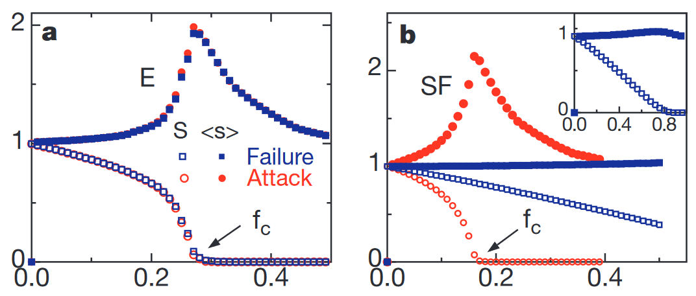

# Robustness of Complex Graphs with Random Failures and Targeted Attacks
### Will Fairman and David Tarazi

## Abstract
Albert, Jeong, and Barabasi explore the robustness of different complex graphs by looking at two specific types of failure: removing random nodes vs removing nodes with the highest degree. With small rates of failure, the authors use the average shortest path length as a characteristic of robustness. With high rates of failure, where a graph is likely to become disconnected, the authors instead associate robustness with the percentage of nodes that are in the largest connected cluster: representing how much of a network is still usable. This paper specifically compared the Erdos and Renyi (ER) random graph model and the Watts and Strogatz (WS) small world model. We have generated both types of graphs using networkX and are planning on using the python library for this experiment as well.

## Proposal
In our exploration, we will replicate some of the experiments that Albert, Jeong, and Barabasi conducted while extending this application to a real world example. In our replication, we will implement two graphs: a Watts-Strogatz Scale Free Network, and an ER Exponential Network following their size and number of edges. We then will conduct a random attack on the nodes as well as a targeted attack on the most connected nodes. When analyzing these, we will look at the average shortest path length for both graphs as we remove nodes. We will also evaluate the size of the largest cluster along with the average size of the isolated clusters as the graph disconnects over enough failures/attacks. We hope that we can find the critical failure value where these networks become disconnected.

Once we have replicated these results, we will look at applying the implementation to a model we downloaded for an electrical grid in order to analyze the electrical grid’s robustness to both random failure (as if during a bad storm) and attacks on that grid. In this exploration, we also hope to investigate what would happen if instead of just attacking nodes, edges started to randomly fail.  We hope that this would give us a better idea of how the grid would respond to environmental disasters that are more likely to affect the ability for a node to transmit power to another node.

Here we can take a look at the results from Albert, Jeong, and Barabasi's experiments and what our replication results will hopefully resemble (but maybe in a slightly clearer representation).

**Figure 1:** Path length replication as nodes are removed randomly and targeted.

**Figure 2:** Average clustering as nodes are removed randomly and targeted.

In replication, we hope that we see the same or similar results to what the original authors came up with. In figure 1, they note that average path length for the ER graph increases at the same rate for targeted attacks and random attacks on nodes, but is somewhere in the middle relative to the WS graph. For the WS graph, it is far more robust to random attacks, but when you target central connected nodes, the average path length increases quite quickly. For figure 2 they observe that average clustering drops off a little later with both random and targeted attacks in the ER graph, but for the WS graph, they observe that it takes a lot longer for a random attack to disconnect the graph and this process occurs linearly as opposed to an exponential decay. However, they observe that a targeted attack quickly destroys this network. 

**Figure 3:** Our expected results with experimenting with a power grid network and attempting to conduct random edge removal as opposed to node removal.

In our experiment, we can observe the differences in how long it takes for a random attack to disconnect the network (both with nodes attacked and edges attacked) and if we observe that the average cluster size over time drops exponentially, that the electrical grid isn’t very robust, and we can pinpoint a critical failure rate that the electrical grid completely disconnects for both edges and nodes.

Our first step will be creating tools in python that can generate ER and WR graphs and implement the three types of attacks we’re exploring: random node/edge failure and targeted node failure. Our second step will be coming up with a list of experiments we want to run in order to replicate results of this paper. Our third step will be running the experiments and generating graphs that we can compare to the paper. We will then finally apply similar experiments to our real-world dataset and extract meaningful information such as: comparisons to ER/WR, significance of robustness to different types of failures.

We feel that replicating the experiments will be relatively straightforward and we aren’t worried about that aspect of the project. However, we are worried that our real-world dataset will not provide us with any value, especially with the power grid network’s scale being the entire Western United States (as opposed to a more detailed graph in a city). With these results, we worry that it will be difficult to interpret them in a way that tells us something about the world.

## Annotated Bibliography
[Error and Attack Tolerance of Complex Networks](https://www.nature.com/articles/35019019.pdf?origin=ppub)  
Albert, R., Jeong, H. & Barabási, AL. Error and attack tolerance of complex networks. Nature 406, 378–382 (2000). https://doi.org/10.1038/35019019
>This paper discusses some of the implications of random and targeted attacks on ER and WS graphs (as well as an Internet model) in order to quantify their robustness to these attacks.

[Western US States Power Grid Network Model](http://konect.cc/networks/opsahl-powergrid/)
>This model represents the Western US States’ power grid that we plan to use for our experimentation. The nodes are transformers, substations, and generators, and the edges are high-voltage transmission lines.
